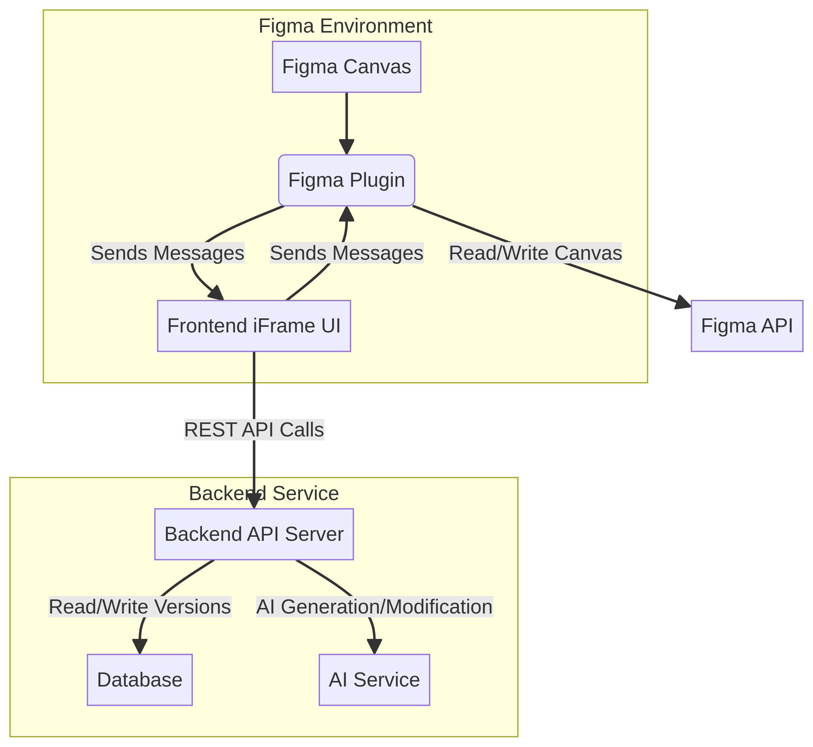
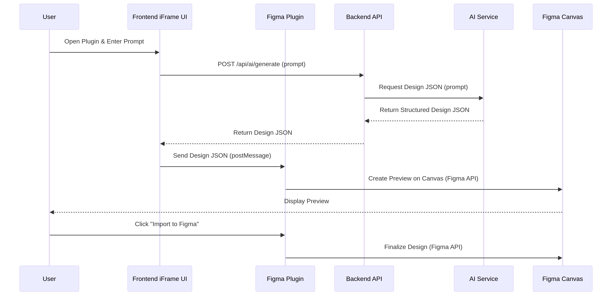
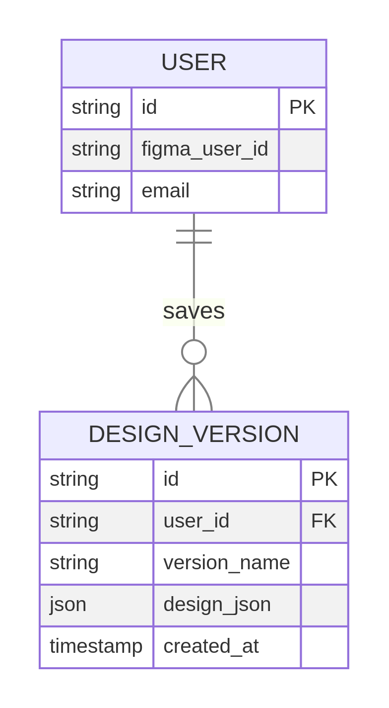

# **Design Tool Pro: Figma Plugin**

## **Table of Contents**

1. Project Overview
2. Architecture Overview
3. Technology Stack
4. Project Structure
5. Core Concepts (Features & Use Cases)
6. API Documentation
7. Database Schema (Design Versions)
8. Authentication & Security
9. Development Guide
10. Diagrams

---

## **1. Project Overview**

### **Purpose**

**Design Tool Pro** is a powerful Figma plugin designed to **accelerate the design workflow** by integrating AI-powered generation, data-driven design, and robust version control directly within the Figma environment. It is built as a full-stack application, consisting of a Figma plugin interface, a web-based frontend (UI), and a dedicated backend service.

### **Key Features**

- **AI Generate**: Conversational AI to generate new designs or modify existing selections.
- **Paste JSON**: Instantly convert structured JSON data into a Figma design.
- **Export to JSON**: Convert any Figma selection into a clean, structured JSON for developer handoff.
- **Versions**: Save and load design states to a personal, persistent database.

### **Business Value**

- **Increased Efficiency**: Automates repetitive design tasks using AI and data.
- **Improved Handoff**: Provides developers with structured, ready-to-use design data.
- **Reliable Versioning**: Offers a robust, personal history for design iterations outside of Figma's native versioning.

---

## **2. Architecture Overview**

### **Layer Structure**

The application follows a three-tier architecture, where the Figma plugin acts as the presentation layer, communicating with a dedicated backend service.

| Layer | Component | Responsibility |
| :--- | :--- | :--- |
| **Presentation** | `figma-plugin/` | Interacts with the Figma API (canvas, selection, user data) and manages the iFrame UI. |
| **Application** | `frontend/` | The web application (UI) running inside the iFrame, handling user input and communicating with the Backend API. |
| **Service/Data** | `backend/` | Handles business logic, AI integration, database operations (for Versions), and exposes the REST API. |

### **Data Flow**

1.  **User Action** → Figma Plugin (`figma-plugin/`)
2.  **Plugin** → Sends message to Frontend iFrame (`frontend/`)
3.  **Frontend** → Makes API call to Backend Service (`backend/`)
4.  **Backend** → Processes request (e.g., calls AI service, queries database)
5.  **Backend** → Returns response to Frontend
6.  **Frontend** → Sends message back to Plugin
7.  **Plugin** → Executes Figma API calls to modify the canvas

### **Architecture Diagram**



---

## **3. Technology Stack**

### **Core Technologies**

- **Figma Integration**: Figma Plugin API
- **Frontend**: React, Vite, TypeScript (runs in iFrame)
- **Backend**: Node.js (Express.js or similar), TypeScript
- **Database**: Persistent storage for design versions (e.g., PostgreSQL, MongoDB - *Specific implementation is in the backend*)
- **AI Service**: External LLM/AI API for design generation and modification.

### **Development Tools**

- **Package Manager**: npm or yarn
- **Build Tool**: Webpack/Vite (for frontend), TypeScript Compiler (for backend)
- **Testing**: (To be determined by project structure)

---

## **4. Project Structure**

### **Directory Layout**

```
task-creator/
├── backend/            # Server-side logic, API endpoints, AI integration, DB access
│   ├── src/
│   └── package.json
├── frontend/           # Web application (UI) running inside the Figma iFrame
│   ├── src/
│   └── package.json
├── figma-plugin/       # Main plugin code, manifest.json, and Figma API interaction
│   ├── src/
│   └── manifest.json
├── README.md
└── package.json        # Root dependencies and scripts
```

---

## **5. Core Concepts (Features & Use Cases)**

### **Core Entity: Design Version**

The primary persistent entity is the **Design Version**, which is a snapshot of a Figma selection stored as a structured JSON object.

```typescript
interface DesignVersion {
  id: string;
  userId: string;
  name: string;
  timestamp: Date;
  designJson: object; // The structured JSON exported from Figma
}
```

### **Key Use Cases**

| Feature | Use Case | Description |
| :--- | :--- | :--- |
| **AI Generate** | `GenerateDesignUseCase` | Takes a text prompt and returns a structured design JSON from the AI service. |
| | `ModifyDesignUseCase` | Takes a selected design JSON and a modification prompt, returns the modified design JSON. |
| **Paste JSON** | `ImportDesignUseCase` | Takes a user-provided JSON and imports it directly to the Figma canvas via the plugin. |
| **Export to JSON** | `ExportDesignUseCase` | Exports the current Figma selection to a standardized JSON format. |
| **Versions** | `SaveVersionUseCase` | Stores the exported design JSON in the database, linked to the user. |
| | `LoadVersionUseCase` | Retrieves a saved design JSON from the database and imports it to the canvas. |

---

## **6. API Documentation**

The backend service exposes a REST API for the frontend to consume.

### **Base URL**

- Development: `http://localhost:8000` (or as configured)
- Production: `https://task-creator-api.onrender.com` (or as configured)

### **Key API Endpoints**

| Method | Endpoint | Description | Auth Required |
| :--- | :--- | :--- | :--- |
| `POST` | `/api/ai/generate` | Generates a new design based on a text prompt. | Yes |
| `POST` | `/api/ai/modify` | Modifies a selected design based on a text prompt. | Yes |
| `POST` | `/api/versions/save` | Saves the current design selection as a new version. | Yes |
| `GET` | `/api/versions/list` | Retrieves a list of all saved versions for the current user. | Yes |
| `GET` | `/api/versions/load/:id` | Retrieves the JSON for a specific saved version. | Yes |

---

## **7. Database Schema (Design Versions)**

The database stores design versions for the user.

```sql
-- Conceptual SQL Schema for Design Versions
CREATE TABLE design_versions (
    id UUID PRIMARY KEY DEFAULT gen_random_uuid(),
    user_id VARCHAR(255) NOT NULL,          -- Figma user ID or internal user ID
    version_name VARCHAR(255) NOT NULL,
    design_json JSONB NOT NULL,             -- The full structured design data
    created_at TIMESTAMP DEFAULT CURRENT_TIMESTAMP
);
```

---

## **8. Authentication & Security**

### **Authentication Flow**

The plugin must identify the user to link saved versions to the correct account.

1.  **User Identification**: The plugin retrieves the unique user ID from the Figma API (`figma.currentUser.id`).
2.  **Backend Auth**: This user ID is passed to the backend, typically via a secure token or header, to authenticate requests and ensure data isolation (e.g., a user can only access their own saved versions).

### **Security Considerations**

- **CORS**: The backend must be configured to allow requests from the Figma iFrame origin.
- **API Key Management**: The AI service API key must be securely stored and used only on the backend, never exposed to the frontend or plugin code.

---

## **9. Development Guide**

### **Prerequisites**

- Node.js (LTS version recommended)
- npm or yarn
- Figma Desktop App

### **Setup Instructions**

1.  **Clone Repository**
    ```bash
    gh repo clone Rezkaudi/task-creator
    cd task-creator
    ```

2.  **Backend Setup**
    ```bash
    cd backend
    npm install
    # Start the backend server (e.g., on port 8000)
    npm start
    ```

3.  **Frontend/Plugin Setup**
    ```bash
    # Frontend UI
    cd ../frontend
    npm install
    npm run dev # Starts development server (e.g., on port 5173)

    # Figma Plugin Code
    cd ../figma-plugin
    npm install
    npm run build # Builds the plugin code
    ```

4.  **Critical Configuration: Connecting Plugin to Local Backend**

    Locate the file that defines the base API URL and change the production URL to your local development URL (e.g., `http://localhost:8000`).

    | File to Modify | Purpose | Example Change |
    | :--- | :--- | :--- |
    | `figma-plugin/src/shared/constants/plugin-config.ts` | Contains the `BASE_API_URL` constant. | Change `https://task-creator-api.onrender.com` to `http://localhost:8000` |

5.  **Testing in Figma**

    1.  Open the Figma Desktop App.
    2.  Go to **Plugins > Development > Import plugin from manifest...**
    3.  Select the `manifest.json` file from the `figma-plugin` directory.
    4.  Run the plugin. It should now connect to your locally running backend and frontend services.

### **Development Commands**

| Command | Location | Description |
| :--- | :--- | :--- |
| `npm start` | `backend/` | Starts the production backend server. |
| `npm run dev` | `frontend/` | Starts the frontend development server with hot reload. |
| `npm run build` | `figma-plugin/` | Compiles the plugin code for testing/deployment. |

---

## **10. Diagrams**

### **System Architecture Diagram**


### **Data Flow Sequence Diagram (AI Generate)**



### **Design Version Entity Relationship Diagram**


